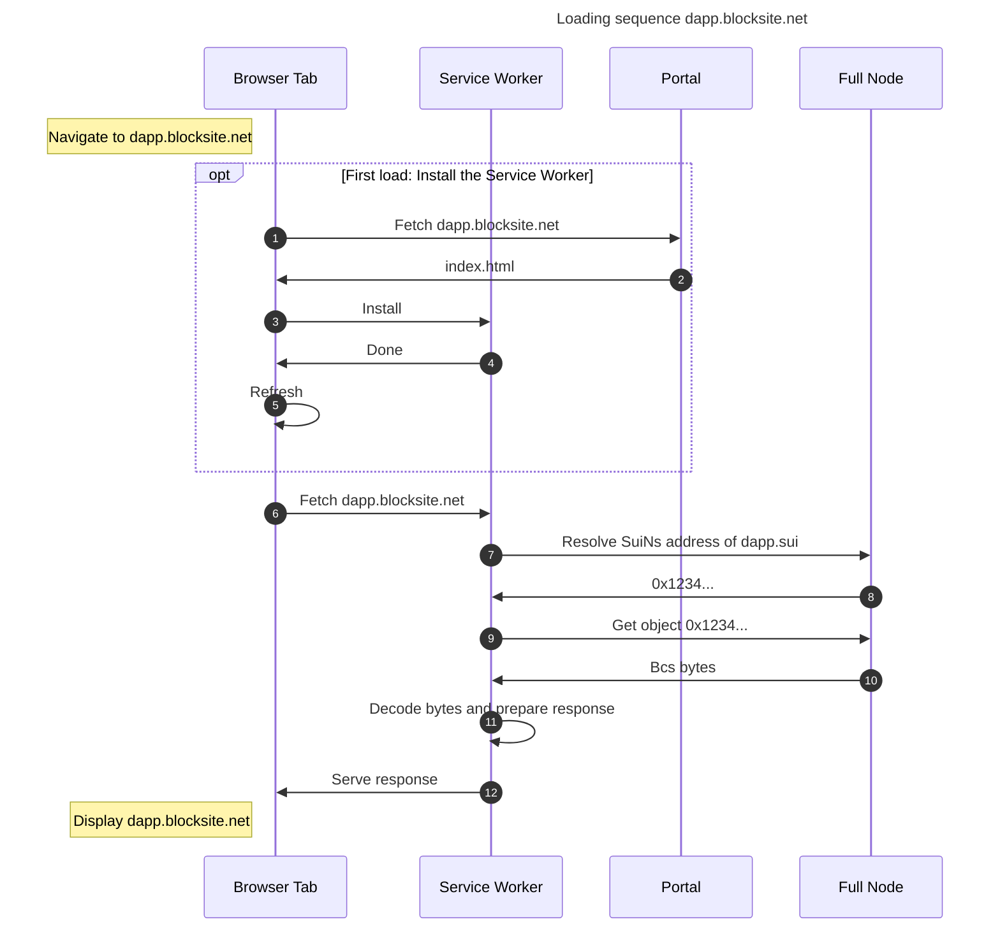

# Blocksites!

This repo contains the various components of a working blocksite proof of concept.
A "blocksite" is a website that is hosted in owned objects on Sui.

## Repo structure

- `move` contains the smart contract for creating and updating blocksites on chain.
- `sw-portal` is the implmentation of the portal to access blocksites. This is the most recent implementation, based on service workers.
- The `site-builder` is a Rust cli tool to create blocksites on chain, starting from a directory containing html/css/js...
- In `test-sites` there is a collection of websites to test the functions of the blocksites directly: 
    - `landing-blocksite`: a landing page for the blocksites, with some info on the project, a snake game, and some images.
    - `blockchat`: a simple chat dApp to showcase the potential of blocksites.
    - `encoder`: (WIP) simple hex -> base36 encoding to go from object id to blocksite url.
- `portal-v1` contains the code for the portal original portal, which is based on iframes (_no wallet connection_)

## Running & testing
 
TODO 

## Known issues

Problems with functionality & security are documented in the github issues.

## Operation

