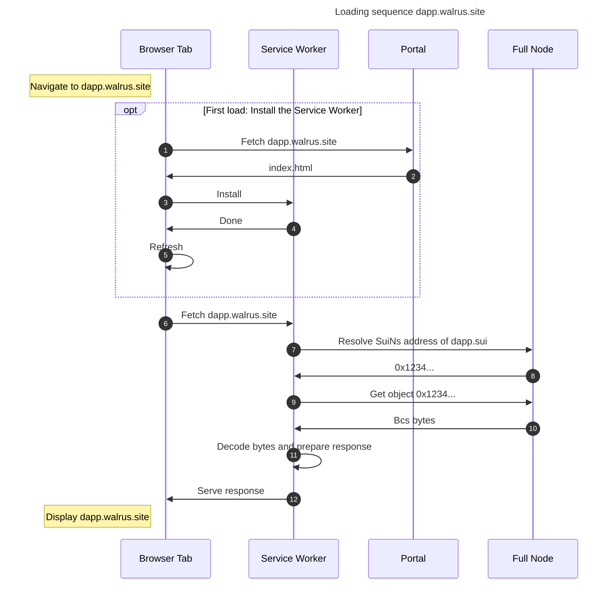

# Walrus Sites Portal

A Walrus sites portal is a support component in Walrus sites that is responsible for installing the browser-side service workers that perform the
website loading.  This directory contains such an implementation of a Walrus sites portal page.

The primary components of the portal are a (static) index page, which can be found in `./static`, and the typescript file for the service workers,
which can be found in `./src/sw.ts`. The index page itself is rarely seen by the user, but it is responsible for initiating the installation of the
service worker into the user's browser. Once installed in the user's browser, the service worker script handles requests for loading webpages, which
involves loading objects from chain, decoding them, and serving them as responses to the user's requests.

## Deploying the Portal

### Testing on a Local Portal

A local portal can be run from this directory using `pnpm`:

```shell
pnpm install
pnpm serve
```

These commands will build the development version of the portal, serve it to `http://localhost:8080`, and watch for any changes in the source files to
rebuild and serve again.

### Deploying the Portal to Vercel

First, install the [Vercel CLI](https://vercel.com/docs/cli).
Then, given access to the Mysten Vercel Team, it is sufficient to run `vercel --prod`.

## Operation Diagram


